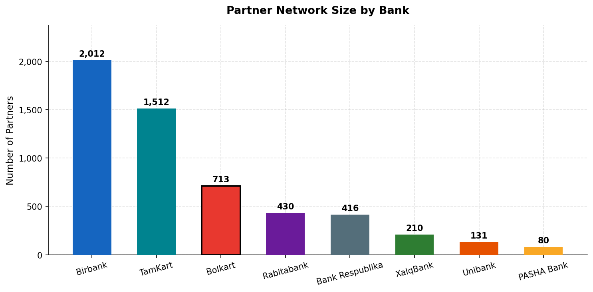
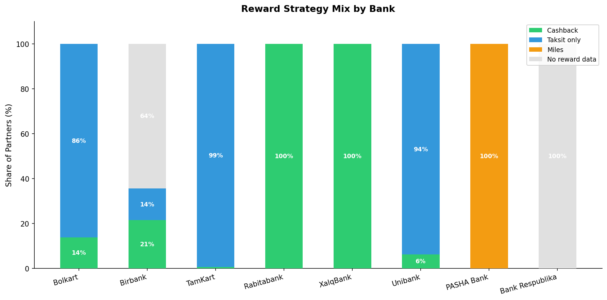
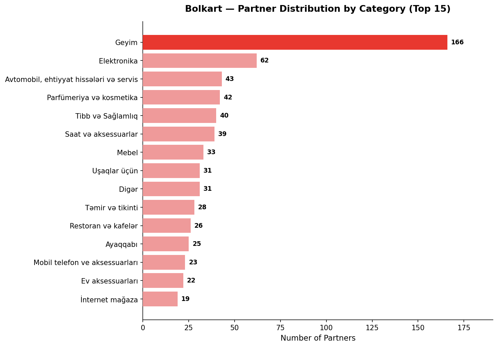
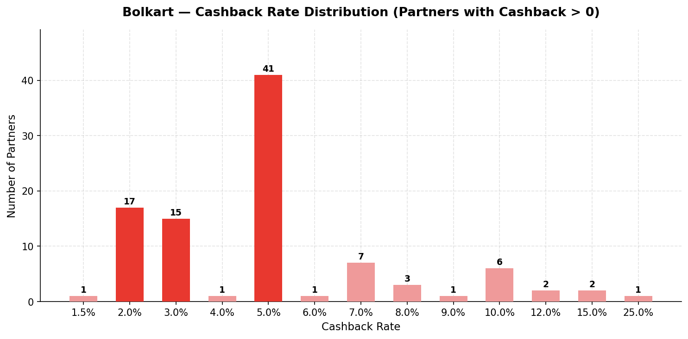
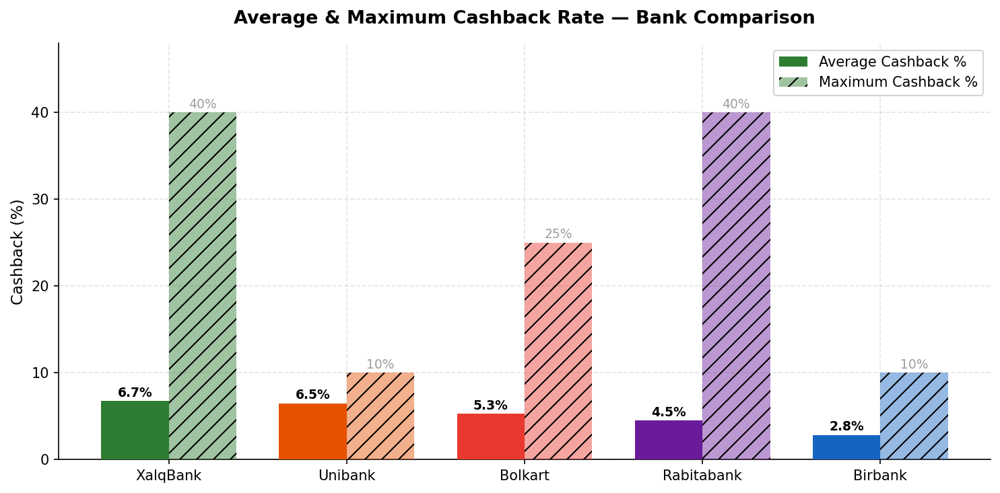
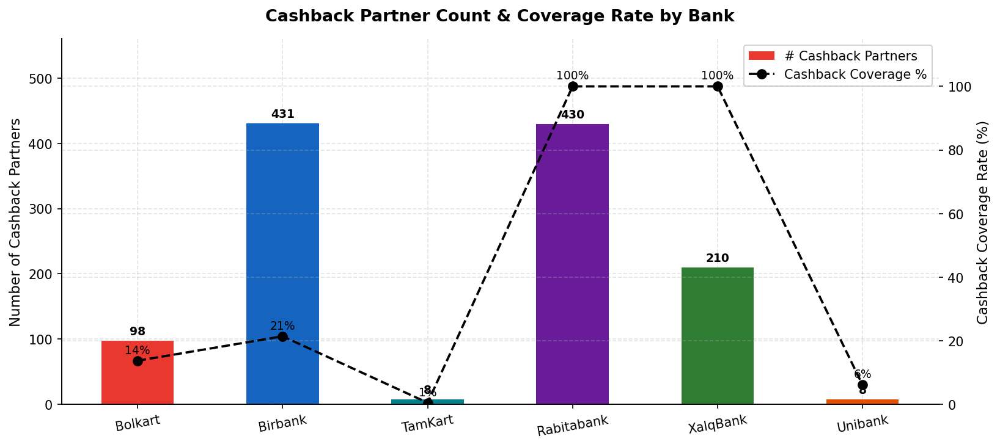
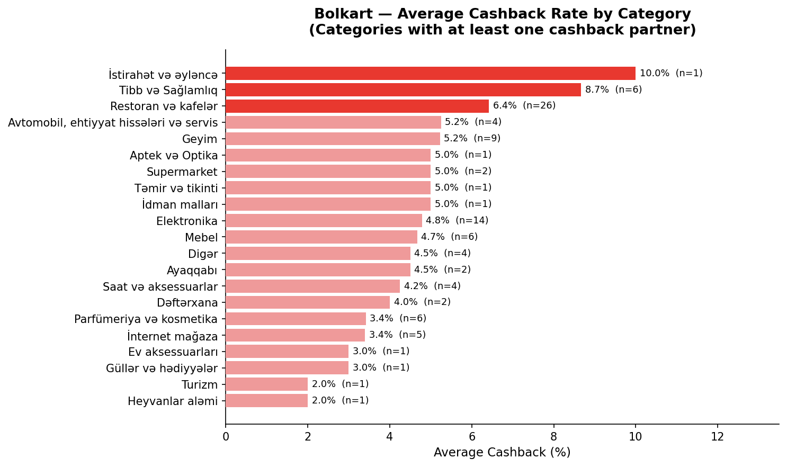
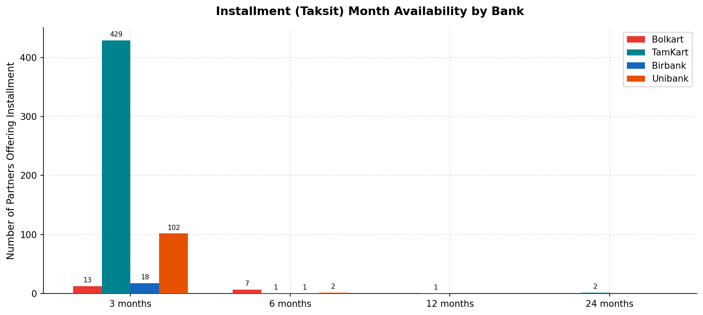
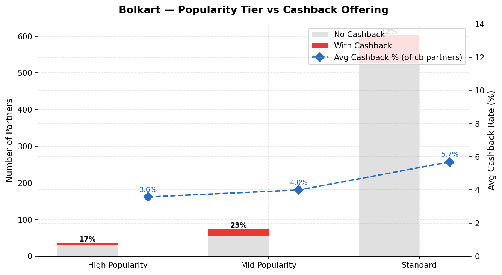
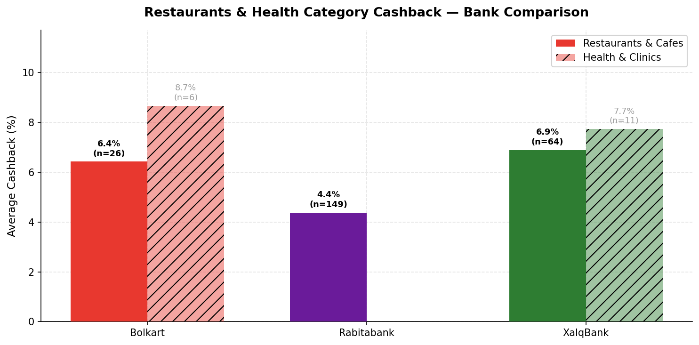

# Azerbaijan Bank Partner Rewards — Business Intelligence Report

> **Focus:** Bolkart vs. the market — where it leads, where it lags, and where the opportunity lies.

---

## Executive Summary

This report analyses the partner reward programs of **8 Azerbaijani banks** — a combined network of **5,504 partner relationships** — with Bolkart placed at the centre of the comparison. The key finding is that Bolkart has built the **third-largest partner network** in the market but monetises only **14% of those partners through cashback**, leaving a significant share of its network operating purely as an installment (taksit) channel. Competitors like Rabitabank and XalqBank convert 100% of their listed partners to cashback, signalling a clear strategic gap Bolkart can close.

---

## 1. Partner Network Size

**What the chart shows:** The total number of merchant partners registered in each bank's reward program.

| Bank | Partners |
|---|---|
| Birbank | 2,012 |
| TamKart | 1,512 |
| **Bolkart** | **713** |
| Rabitabank | 430 |
| Bank Respublika | 416 |
| XalqBank | 210 |
| Unibank | 131 |
| PASHA Bank | 80 |

**Why it matters:** Bolkart holds a clear #3 position in network breadth — nearly 40% larger than Rabitabank and more than 3× the size of XalqBank. This gives Bolkart a strong foundation to build on. However, raw partner count is only meaningful if those partners deliver tangible rewards to cardholders.

**Action:** Use the existing network scale as a sales argument for cardholder acquisition, while prioritising cashback activation for the 615 taksit-only partners.

---

## 2. Reward Strategy: What Banks Are Actually Offering

**What the chart shows:** For each bank, the proportion of partners offering cashback, installments only (taksit), miles, or no reward data.

**Key findings:**

- **Bolkart:** 86% of partners are taksit-only — cardholders earn no cash reward at these merchants.
- **Rabitabank & XalqBank:** 100% of partners offer cashback. Every merchant relationship translates directly into cardholder value.
- **Birbank:** 21% cashback, 14% taksit-only, but 64% have no reward data — a data quality gap.
- **PASHA Bank:** Unique miles-based model (80 partners, 100% miles).

**Why it matters:** Cardholders choose payment methods based on perceived value. A bank where only 1 in 7 partners offers cash back is a weaker top-of-wallet proposition than one where every swipe earns something.

**Action:** Bolkart should renegotiate cashback terms with high-traffic taksit-only partners — starting with the 166 fashion/clothing partners, 62 electronics partners, and 43 automotive merchants where cashback is currently zero.

---

## 3. Bolkart's Category Landscape

**What the chart shows:** How Bolkart's 713 partners are distributed across spending categories.

**Top categories:**

| Category | Partners | Cashback Partners | Avg Cashback |
|---|---|---|---|
| Fashion & Clothing | 166 | 9 | 0.3% |
| Electronics | 62 | 14 | 1.1% |
| Automotive & Parts | 43 | 4 | 0.5% |
| Perfume & Cosmetics | 42 | 6 | 0.5% |
| Health & Medical | 40 | 6 | 1.3% |
| Watches & Accessories | 39 | 4 | 0.4% |
| Restaurants & Cafes | 26 | **26** | **6.4%** |

**Why it matters:** Fashion is Bolkart's largest category by headcount (166 partners) yet only 5% of those partners offer any cashback, at an average of just 0.3%. Meanwhile, the Restaurants category — much smaller in headcount (26) — has a **100% cashback activation rate** and a 6.4% average rate. This shows that cashback negotiations are possible and successful — the model just needs to be replicated across other categories.

**Action:** Use the restaurant cashback model as the template for expanding cashback into fashion, electronics, and cosmetics.

---

## 4. Bolkart Cashback Rate Distribution

**What the chart shows:** Among the 98 Bolkart partners that offer cashback, how many fall at each rate tier.

**Key findings:**

- **5% cashback** is the modal rate — 41 partners (42% of all Bolkart cashback partners).
- **2% and 3%** are the next most common tiers (17 and 15 partners respectively).
- A small premium tier exists at 10%+ (including one partner at 25% — the highest in the Bolkart network).
- The average cashback rate among active partners is **5.3%**.

**Why it matters:** The concentration at 5% is a healthy baseline but the tail at 10–25% shows that premium cashback rates are negotiable with certain partner segments (health, restaurants, electronics). This premium tier needs to be expanded, not left as an outlier.

**Action:** Design a tiered partner program: standard (2–5%), preferred (7–10%), and premium (12%+) — giving merchants a clear upgrade path in exchange for higher foot traffic or exclusivity.

---

## 5. Cashback Rates: Bolkart vs. Competitors

**What the chart shows:** Average and maximum cashback rates across all banks that offer cashback programs.

| Bank | Avg Cashback | Max Cashback | # Cashback Partners |
|---|---|---|---|
| XalqBank | **6.7%** | 40% | 210 |
| Unibank | 6.5% | 10% | 8 |
| **Bolkart** | **5.3%** | **25%** | 98 |
| Rabitabank | 4.5% | 40% | 430 |
| Birbank | 2.8% | 10% | 431 |

**Why it matters:** Bolkart's average rate (5.3%) is competitive — above Rabitabank and Birbank. The 25% maximum shows Bolkart can secure premium deals. The problem is not the rate quality — it is the **volume**: with only 98 cashback partners vs. Rabitabank's 430 and Birbank's 431, Bolkart's cashback program feels boutique when it should be broad.

**Action:** Bolkart's rate quality is strong. The priority is quantity — growing cashback partners from 98 to 250+ by converting existing taksit-only merchants, targeting Rabitabank's coverage breadth.

---

## 6. Cashback Coverage Rate by Bank

**What the chart shows:** Both the raw count of cashback partners and the percentage of total partners that offer cashback.

- Rabitabank: **100%** coverage — every partner earns cashback
- XalqBank: **100%** coverage
- **Bolkart: 14%** — the widest gap vs. coverage-first competitors
- Birbank: 21% (but scale of network makes 431 cashback partners still significant)

**Why it matters:** From a cardholder's perspective, Bolkart cardholders earn cashback at only 1 in 7 partner locations they visit. Rabitabank cardholders earn it everywhere. This perception gap is a direct retention risk.

**Action:** Set a 12-month target of 30% cashback coverage (≈215 cashback partners) as a measurable milestone visible to both cardholders and merchants.

---

## 7. Bolkart's Best and Worst Cashback Categories

**What the chart shows:** Average cashback rate by category for all Bolkart categories that have at least one cashback partner.

**Top performing categories (highest avg cashback):**

| Category | Avg Cashback | # Partners |
|---|---|---|
| Leisure & Entertainment | 10.0% | 1 |
| Health & Medical | 8.7% | 6 |
| Restaurants & Cafes | 6.4% | 26 |
| Automotive | 5.2% | 4 |
| Fashion | 5.2% | 9 |

**Why it matters:** Health & Medical and Restaurants are not only high-cashback categories — they are high-frequency spending categories. These are exactly the verticals that drive daily card usage. By contrast, Bolkart's largest category (Fashion, 166 partners) has only 9 with cashback — a massive under-monetised block.

**Action:** Prioritise health, restaurants, and electronics for cashback expansion — these drive both frequency and perceived card value.

---

## 8. Installment (Taksit) Month Availability

**What the chart shows:** How many partners at each bank offer 3-, 6-, 12-, and 24-month installment plans.

| Bank | 3-month | 6-month | 12-month | 24-month |
|---|---|---|---|---|
| **Bolkart** | **527** | **505** | 201 | 44 |
| TamKart | 452 | 494 | 884 | 543 |
| Birbank | 86 | 94 | 89 | 1 |
| Unibank | 54 | 63 | 59 | 20 |

**Why it matters:** In the 3- and 6-month range, Bolkart is the market leader — more partners than any competitor. However, TamKart dominates at 12 and 24 months (884 and 543 partners respectively vs. Bolkart's 201 and 44). Long-term installments (12–24 months) are particularly important for high-ticket categories like furniture, electronics, and home renovation — all of which Bolkart has in its network.

**Action:** Bolkart should negotiate 12- and 24-month taksit options with its furniture (33), electronics (62), and automotive (43) partners — where large-ticket purchases make longer installment terms highly attractive to buyers.

---

## 9. Bolkart: Do Popular Partners Get Cashback?

**What the chart shows:** Among Bolkart's three popularity tiers (High, Mid, Standard), how many partners offer cashback vs. installment-only, and what the average cashback rate is per tier.

**Key findings:**

- **High Popularity partners (36 total):** 25% offer cashback, at an average of 6.8%
- **Mid Popularity partners (74 total):** 23% offer cashback, at an average of 5.5%
- **Standard partners (603 total):** Only 11% offer cashback, at an average of 5.1%

**Why it matters:** The most popular partners — the ones cardholders actually visit most — have lower cashback activation rates than they should. High-popularity merchants are exactly the partners where cashback incentives deliver maximum cardholder satisfaction and card usage. Prioritising cashback deals with high-popularity merchants yields disproportionate impact.

**Action:** Flag the 75% of high-popularity partners that are taksit-only and treat them as priority targets for cashback renegotiation.

---

## 10. Restaurants & Healthcare Cashback Across Banks

**What the chart shows:** Average cashback rates for two high-frequency, high-value categories — Restaurants and Healthcare — across Bolkart, Rabitabank, and XalqBank.

| Bank | Restaurants Avg | Health Avg |
|---|---|---|
| **Bolkart** | **6.4%** (26 partners) | **8.7%** (6 partners) |
| XalqBank | 6.9% (64 partners) | 8.0% (17 partners) |
| Rabitabank | 4.4% (149 partners) | 7.4% (17 partners) |

**Why it matters:** Bolkart's rate quality in both categories is **best-in-class** — higher average cashback than XalqBank and Rabitabank. The gap is entirely in **reach**: Bolkart has 26 restaurant partners vs. Rabitabank's 149 and XalqBank's 64. Bolkart has proven it can negotiate excellent rates — it now needs to replicate this across many more merchants.

**Action:** Bolkart's restaurant and health cashback offering is premium-quality. A targeted merchant acquisition campaign in these categories — using the existing rate structure — could double the partner count within 6 months.

---

## Strategic Recommendations Summary

| Priority | Action | Impact |
|---|---|---|
| 🔴 **Immediate** | Convert 615 taksit-only partners to cashback, starting with 75 high-popularity merchants | Highest cardholder perception lift |
| 🔴 **Immediate** | Expand restaurant cashback from 26 → 80+ partners at the current 6%+ rate | Drives daily card usage |
| 🟡 **Short-term** | Introduce tiered partner program (Standard / Preferred / Premium cashback) | Incentivises merchant upsell |
| 🟡 **Short-term** | Target 12- and 24-month taksit for electronics, furniture, automotive | Captures high-ticket segment vs. TamKart |
| 🟢 **Medium-term** | Set measurable 30% cashback coverage target (215+ cashback partners) | Board-level KPI, comparable to competitors |
| 🟢 **Medium-term** | Activate health & medical vertical (currently 6 partners at 8.7%) as hero category | Differentiates Bolkart in the market |

---

## Data Scope

| Bank | Partners Analysed | Reward Type |
|---|---|---|
| Birbank | 2,012 | Cashback + Taksit |
| TamKart | 1,512 | Taksit |
| **Bolkart** | **713** | Cashback + Taksit |
| Rabitabank | 430 | Cashback |
| Bank Respublika | 416 | Partner list only |
| XalqBank | 210 | Cashback |
| Unibank | 131 | Cashback + Taksit |
| PASHA Bank | 80 | Miles |
| **Total** | **5,504** | |

*Data collected February 2026 from each bank's public partner program pages.*
