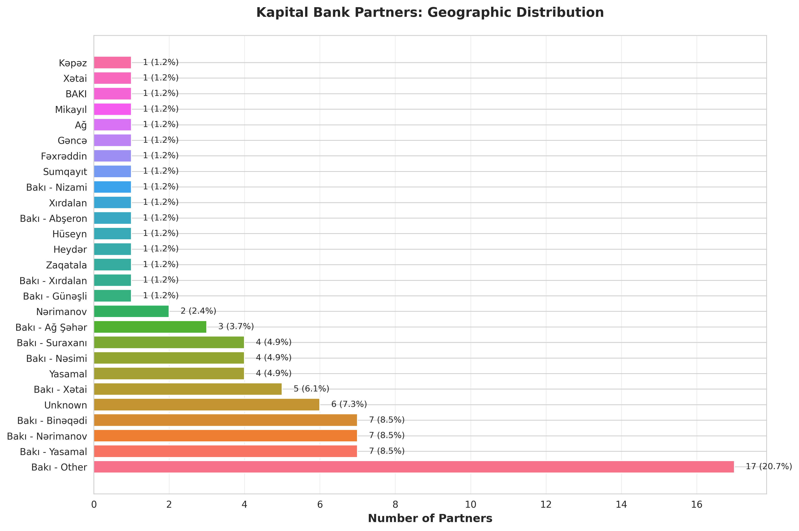
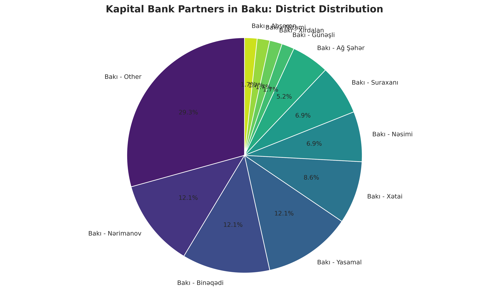
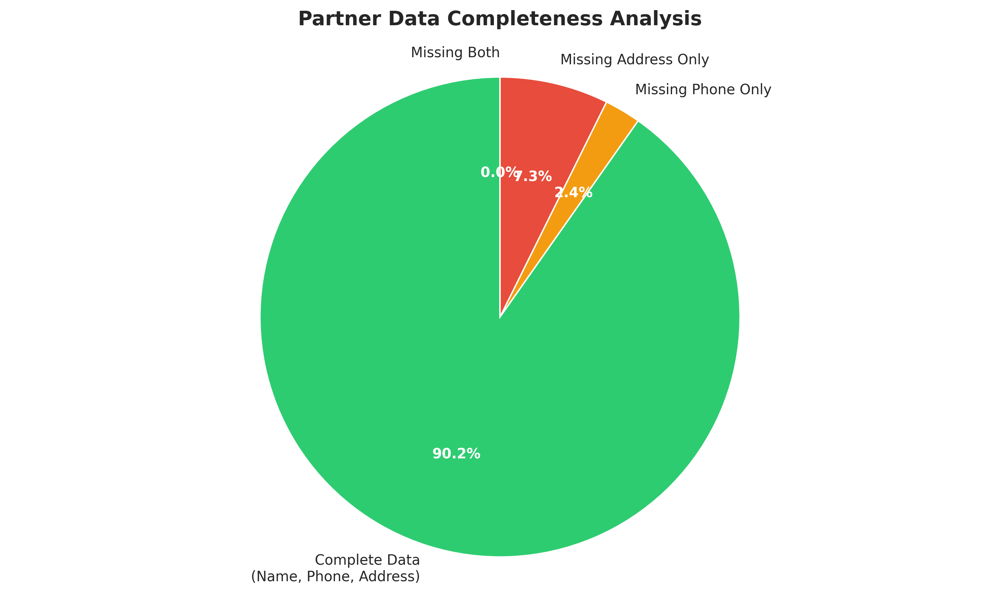
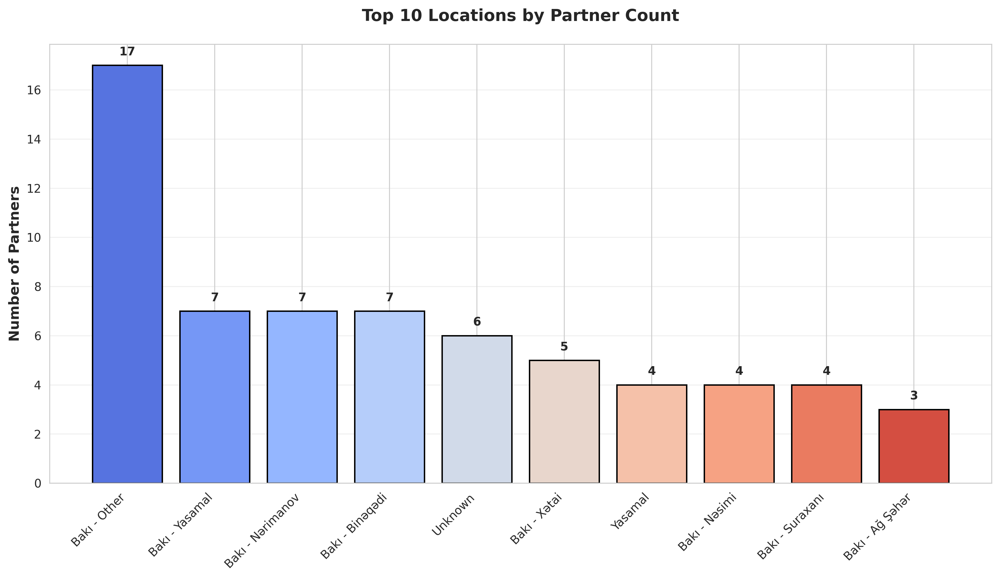
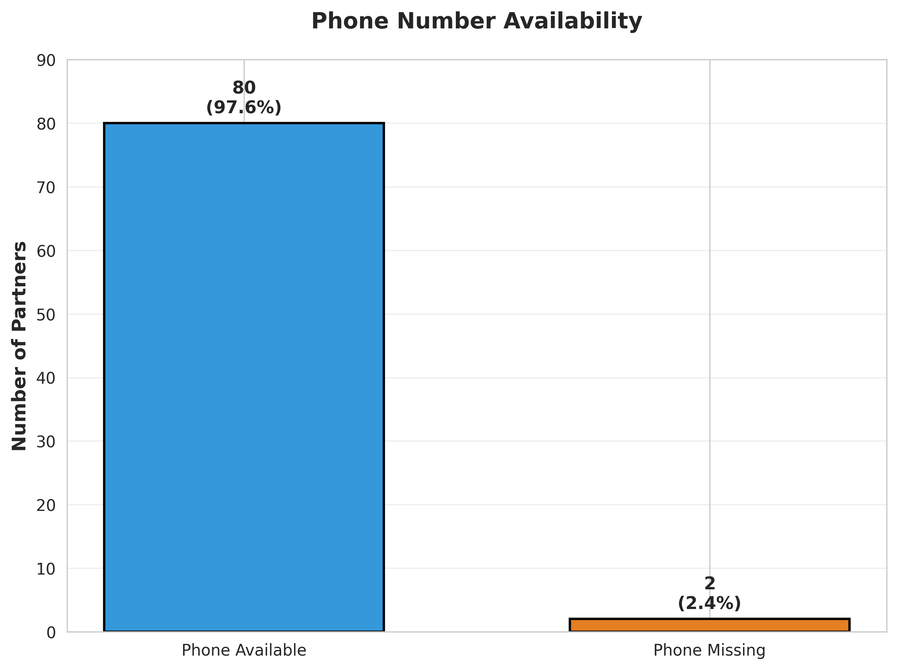
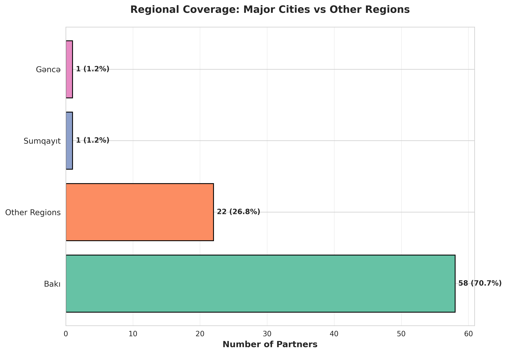

# Kapital Bank Partner List - Data Analysis & Insights

## 📊 Overview

This directory contains comprehensive data visualizations and analysis of **Kapital Bank's partner network** scraped from [ipoteka.kapitalbank.az/partner/list](https://ipoteka.kapitalbank.az/partner/list).

**Dataset Summary:**
- **Total Partners:** 82
- **Data Completeness:** 90.2% (74 partners with complete information)
- **Phone Coverage:** 97.6% (80 partners with phone numbers)
- **Geographic Spread:** 27 unique locations across Azerbaijan

---

## 📈 Visualizations & Key Findings

### 1. Geographic Distribution of Partners

**Key Insights:**
- **Baku dominates** with 70.7% of all partners (58 out of 82)
- Top 3 locations:
  - **Baku - Other districts:** 17 partners (20.7%)
  - **Baku - Yasamal:** 7 partners (8.5%)
  - **Baku - Nərimanov:** 7 partners (8.5%)
  - **Baku - Binəqədi:** 7 partners (8.5%)

**Actionable Insights:**
- 🎯 **Market Concentration:** Focus marketing and support resources on Baku-based partnerships
- 🌍 **Expansion Opportunity:** Only 24 partners (29.3%) are outside Baku, indicating potential for regional growth
- 📍 **Strategic Locations:** Yasamal, Nərimanov, and Binəqədi districts show strong partner presence

---

### 2. Baku Districts - Deep Dive

**Key Insights:**
- **"Other" districts represent 29.3%** of Baku partners - these are smaller districts with single partnerships
- **Yasamal, Nərimanov, and Binəqədi** each hold 12.1% of Baku partners (7 each)
- **Xətai** follows with 8.6% (5 partners)

**Actionable Insights:**
- 🏢 **District Clustering:** Establish district-specific support teams for Yasamal, Nərimanov, and Binəqədi
- 🔍 **Consolidation Opportunity:** Review "Other" districts for potential partnership consolidation
- 📊 **Growth Potential:** Underrepresented districts like Səbail or Nizami could be expansion targets

---

### 3. Data Completeness Analysis

**Key Insights:**
- **90.2%** of partners (74) have complete data (Name, Phone, Address)
- **7.3%** (6 partners) missing only addresses
- **2.4%** (2 partners) missing only phone numbers
- **0%** missing both - excellent data quality!

**Actionable Insights:**
- ✅ **High Data Quality:** 90.2% completeness indicates reliable partner database
- 📞 **Contact Follow-up:** Only 2 partners need phone number updates - easy to resolve
- 🏠 **Address Verification:** 6 partners need address updates for complete records
- 🎯 **Data Maintenance:** Implement quarterly data verification process to maintain >95% completeness

---

### 4. Top 10 Locations by Partner Count

**Key Insights:**
- **Baku - Other** leads with 17 partners
- **Three-way tie** for 2nd place: Yasamal, Nərimanov, and Binəqədi (7 each)
- **Top 10 locations** account for 76 out of 82 partners (92.7%)

**Actionable Insights:**
- 🎯 **Focus Areas:** Concentrate 90% of operational resources on top 10 locations
- 📊 **Performance Benchmarking:** Compare partner performance across these high-density areas
- 🌟 **Best Practices:** Document success factors from high-performing locations

---

### 5. Phone Number Availability

**Key Insights:**
- **97.6%** phone coverage (80 out of 82 partners)
- Only **2 partners** (2.4%) lack phone contact information
- Near-perfect contact accessibility

**Actionable Insights:**
- ✅ **Communication Ready:** Can reach 97.6% of partners directly via phone
- 📱 **Quick Fix:** Only 2 phone numbers needed to achieve 100% coverage
- 🔔 **SMS/WhatsApp Campaigns:** High phone coverage enables direct communication strategies
- 📞 **Emergency Contact:** Establish backup contact methods for the 2 partners without phones

---

### 6. Regional Coverage - Major Cities vs Other Regions

**Key Insights:**
- **Baku:** 58 partners (70.7%) - massive concentration
- **Other Regions:** 14 partners (17.1%)
- **Unknown:** 6 partners (7.3%)
- **Gəncə:** 1 partner (1.2%)
- **Sumqayıt:** 1 partner (1.2%)

**Actionable Insights:**
- 🚨 **Critical Imbalance:** Baku represents 70.7% while Azerbaijan's 2nd largest city (Gəncə) has only 1 partner
- 🌍 **Major Expansion Opportunity:**
  - **Gəncə** (Azerbaijan's 2nd largest city) - only 1 partner
  - **Sumqayıt** (3rd largest city) - only 1 partner
  - **Mingəçevir** - not represented at all
- 🎯 **Strategic Priority:** Develop regional expansion strategy for major cities outside Baku
- 📈 **Growth Potential:** Target at least 10-15% partner presence in each major city

---

## 💡 Strategic Recommendations

### Immediate Actions (0-3 months)
1. **Data Cleanup:**
   - ✅ Obtain missing phone numbers (2 partners)
   - ✅ Verify and update missing addresses (6 partners)
   - Target: 100% data completeness

2. **Partner Communication:**
   - Launch SMS/WhatsApp communication campaign (97.6% reachable)
   - Create partner newsletter highlighting new developments
   - Establish monthly partner check-ins for top locations

3. **Geographic Assessment:**
   - Analyze performance metrics for Baku vs regional partners
   - Identify reasons for low regional presence
   - Survey existing partners for expansion recommendations

### Short-term Initiatives (3-6 months)
1. **Regional Expansion:**
   - **Target:** Add 5-10 partners in Gəncə
   - **Target:** Add 5-10 partners in Sumqayıt
   - **Target:** Add 3-5 partners in Mingəçevir
   - Goal: Reduce Baku concentration to <60%

2. **District Optimization (Baku):**
   - Create district-specific support teams for Yasamal, Nərimanov, Binəqədi
   - Analyze district performance to identify best practices
   - Expand presence in underrepresented districts (Nizami, Səbail)

3. **Partner Engagement:**
   - Develop tiered partner program based on location density
   - Create incentives for high-performing locations
   - Implement partner feedback mechanism

### Long-term Strategy (6-12 months)
1. **Nationwide Coverage:**
   - Establish presence in all major cities (>50,000 population)
   - Target: Minimum 2-3 partners per major city
   - Develop rural/regional hub strategy

2. **Data Intelligence:**
   - Implement automated data quality monitoring
   - Create partner performance dashboard
   - Establish predictive analytics for partner success

3. **Partnership Excellence:**
   - Document and replicate success patterns from top locations
   - Create partner certification/training program
   - Develop strategic partnership tiers (Gold/Silver/Bronze)

---

## 📊 Data Quality Metrics

| Metric | Value | Status |
|--------|-------|--------|
| Total Partners | 82 | ✅ Good base |
| Complete Data | 90.2% | ✅ Excellent |
| Phone Coverage | 97.6% | ✅ Excellent |
| Address Coverage | 92.7% | ✅ Very Good |
| Geographic Diversity | 27 locations | ⚠️ Baku-heavy |
| Major Cities Coverage | 3 cities | ❌ Needs improvement |

---

## 🎯 Success Indicators

**Current State:**
- ✅ Strong Baku presence (70.7%)
- ✅ Excellent data quality (90.2%)
- ✅ High contact accessibility (97.6%)
- ❌ Limited regional presence (17.1%)
- ❌ Major cities underserved (Gəncə, Sumqayıt)

**Target State (12 months):**
- 🎯 Balanced regional distribution (Baku <60%, Regions >40%)
- 🎯 100% data completeness
- 🎯 Presence in all 10 major cities (minimum 3 partners each)
- 🎯 Double total partner count (82 → 150+)
- 🎯 Automated data quality monitoring system

---

## 📁 Files in This Directory

| File | Description |
|------|-------------|
| `01_geographic_distribution.png` | Horizontal bar chart showing partner distribution across all locations |
| `02_baku_districts.png` | Pie chart detailing partner distribution within Baku districts |
| `03_data_completeness.png` | Pie chart analyzing data quality and missing information |
| `04_top_10_locations.png` | Bar chart highlighting the top 10 locations by partner count |
| `05_phone_availability.png` | Bar chart showing phone number coverage |
| `06_regional_coverage.png` | Horizontal bar chart comparing major cities vs other regions |

---

## 🔄 Data Refresh

**Last Updated:** November 22, 2025
**Source:** [Kapital Bank Partner List](https://ipoteka.kapitalbank.az/partner/list)
**Next Refresh:** Recommended quarterly or when significant partner changes occur

---

## 📞 Contact & Feedback

For questions about this analysis or to report data discrepancies, please refer to the main project repository.

---

*Analysis generated using Python (pandas, matplotlib, seaborn) | All charts are high-resolution PNG files (300 DPI)*
